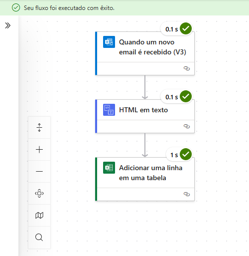
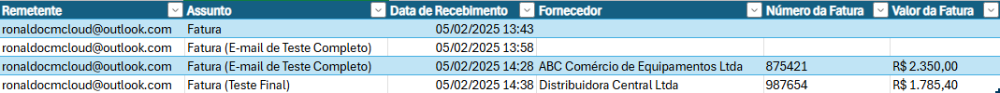

# Projeto 5 – Extração de Dados do Corpo do E-mail para Planilha Excel

## 📌 Introdução

Este fluxo automatizado no **Power Automate** foi desenvolvido para monitorar uma caixa de entrada do Outlook e extrair automaticamente três informações específicas do corpo de e-mails que contenham a palavra **"Nota Fiscal"** no assunto: **Fornecedor**, **Número da Fatura** e **Valor**. Essas informações são registradas de forma estruturada em uma planilha do **Excel (OneDrive)**.

## ⚙️ Tecnologias Utilizadas

- Power Automate (Web)
- Outlook (Conector de E-mail)
- Excel Online (OneDrive)
- Expressões em Power Automate
- Conversão de HTML para Texto

## 🚀 Funcionalidades

- Monitoramento automático da caixa de entrada de e-mails.
- Filtro por assunto contendo a palavra **"Nota Fiscal"**.
- Extração de trechos específicos do corpo do e-mail.
- Armazenamento das informações em planilha Excel.
- Formatação de data e hora do recebimento.

## 🔄 Etapas do Fluxo

1. **Disparador:** Quando um novo e-mail chega na caixa de entrada.
2. **Condição:** Verifica se o assunto contém "Nota Fiscal".
3. **Converter HTML em Texto:** Transforma o corpo do e-mail em texto puro.
4. **Extração com Expressões:**
   - **Fornecedor:**  
     `split(split(string(outputs('HTML_em_texto')), 'Fornecedor: ')[1], '\n')[0]`
   - **Número da Fatura:**  
     `split(split(string(outputs('HTML_em_texto')), 'Número da Fatura: ')[1], '\n')[0]`
   - **Valor:**  
     `split(split(string(outputs('HTML_em_texto')), 'Valor: ')[1], '\n')[0]`
5. **Registrar no Excel:** Preenche a planilha com os seguintes dados:
   - **Remetente**
   - **Assunto**
   - **Data Formatada:**  
     `formatDateTime(triggerOutputs()?['body/receivedDateTime'], 'dd/MM/yyyy HH:mm:ss')`
   - **Fornecedor**
   - **Número da Fatura**
   - **Valor**

## 🖼️ Prints Ilustrativos

### 1. Fluxo Final no Power Automate

### 2. Planilha de Excel com os Dados Preenchidos

## 📚 Aprendizados e Observações

- Foi essencial aplicar a função de **conversão de HTML para texto** para obter as informações do corpo do e-mail sem marcas HTML.
- As expressões com `split()` facilitaram a extração precisa das informações.
- Aprendemos que expressões como `split()` podem ser inseridas diretamente nas ações como “Adicionar uma linha em uma tabela”, sem a necessidade da ação “Compor”.
- Com essa automação, é possível organizar e armazenar documentos fiscais com precisão e sem esforço manual.

---

