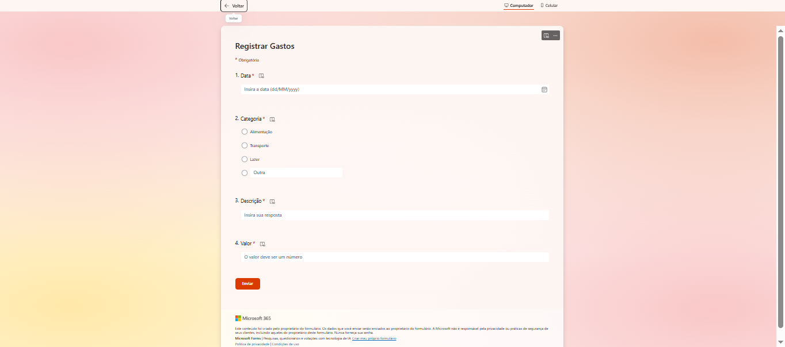
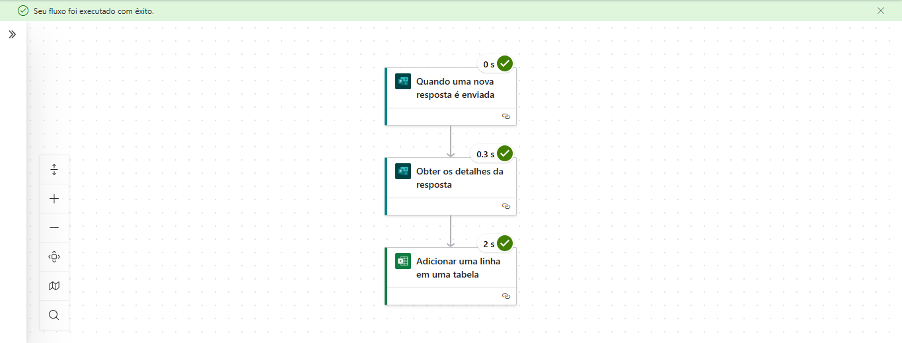
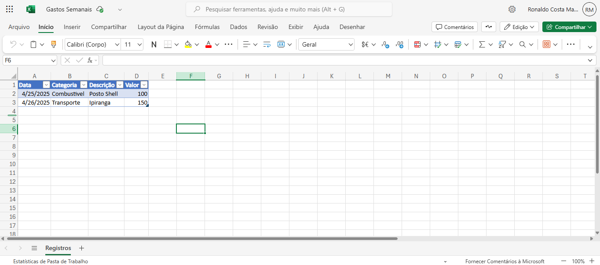

# Projeto 1 - Registro Automático de Gastos com Power Automate

## ✅ O que faz
Recebe dados via Microsoft Forms e insere automaticamente em uma planilha Excel Online no OneDrive.

## 💡 Por que é útil
Permite registrar gastos de forma rápida, organizada e automatizada, sem precisar abrir planilha nem digitar manualmente.

## 🧪 Tecnologias Usadas
- Power Automate (Microsoft)
- Microsoft Forms
- Excel Online / OneDrive

## 📸 Imagens

### Formulário

### Fluxo no Power Automate

### Planilha Excel

## 🚀 Como testar
1. Acesse o formulário (caso queira disponibilizar)
2. Preencha um registro fictício
3. Verifique a planilha no OneDrive atualizando automaticamente os dados

---

📅 **Data de Conclusão:** 25/04/2025  
🧠 **Desafio:** Criar um projeto RPA do zero, mesmo sem curso formal, com foco em execução e aprendizado prático.
