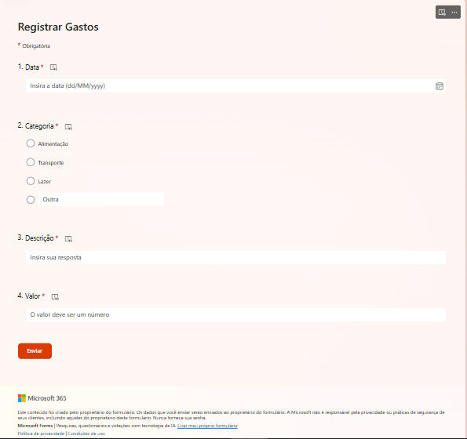
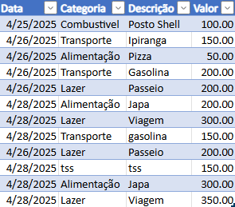
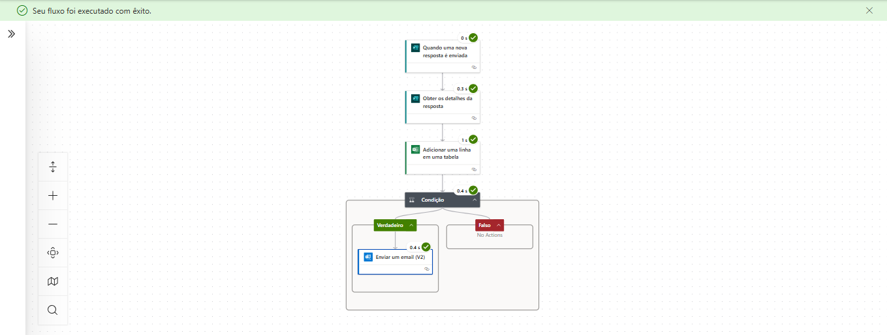
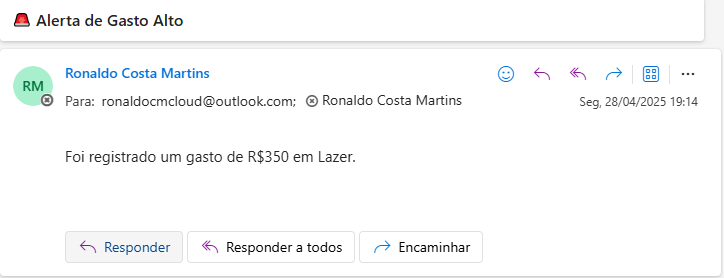

# Projeto 2 – Alerta de Gasto Alto

Este projeto consiste em uma automação com Microsoft Forms + Excel + Power Automate que envia um **alerta por e-mail** quando um valor acima de R$100 é registrado.

## 💡 Objetivo

Praticar lógica condicional e integração entre ferramentas Microsoft para criar um sistema de notificação automatizada de gastos.

## ⚙️ Tecnologias utilizadas

- Microsoft Forms
- Microsoft Excel Online
- Power Automate
- Outlook (e-mail)
- GitHub

## 🔗 Funcionamento

1. O usuário preenche um formulário com:
   - Categoria
   - Valor
2. A resposta é armazenada em uma planilha Excel online.
3. O Power Automate verifica se o valor é maior que R$100.
4. Se for, envia um **e-mail de alerta automático**.

## 📸 Prints

### Formulário Forms:

### Planilha Excel:

### Fluxo Power Automate:

### E-mail recebido:

