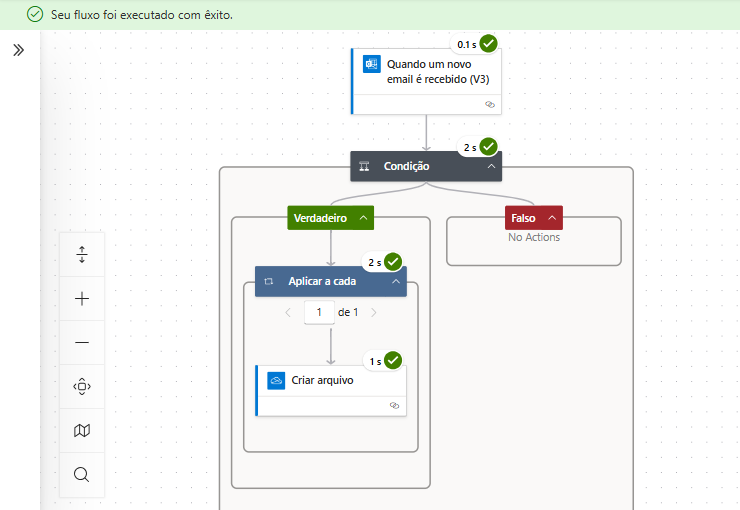
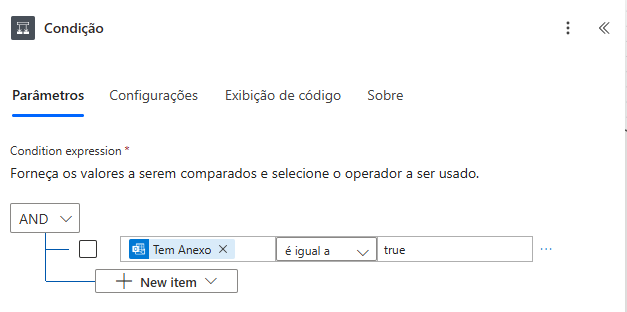
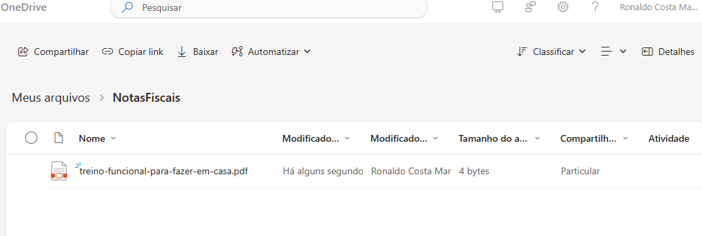

# 📄 Projeto 4 – Salvar Anexos de E-mails com "Nota Fiscal" no Assunto

## 🚀 Introdução

Este projeto tem como objetivo automatizar o salvamento de **anexos de e-mails que contenham "Nota Fiscal" no assunto**. A automação foi criada usando o Power Automate e salva os arquivos diretamente em uma pasta do OneDrive, otimizando o processo de arquivamento e organização de documentos fiscais.

---

## 🛠️ Tecnologias Utilizadas

- Power Automate (nuvem)
- Outlook (Conector de e-mails)
- OneDrive (Armazenamento em nuvem)

---

## ⚙️ Funcionalidades

- Monitorar a caixa de entrada do Outlook.
- Verificar se o assunto do e-mail contém a expressão **"Nota Fiscal"**.
- Salvar automaticamente os anexos desses e-mails em uma **pasta específica no OneDrive**.

---

## 🔄 Etapas do Fluxo

1. **Gatilho**: O fluxo inicia quando um novo e-mail chega à caixa de entrada do Outlook.
2. **Condição**: O fluxo verifica se o assunto do e-mail contém a expressão **"Nota Fiscal"**.
3. **Se a condição for verdadeira**:
   - Percorre todos os anexos do e-mail.
   - Salva cada anexo na pasta **"AnexosNotaFiscal"** do OneDrive.
4. **Se a condição for falsa**:
   - O fluxo é encerrado sem nenhuma ação.

---

## 🖼️ Prints Ilustrativos

### ✅ Gatilho: Quando um novo e-mail chega

### ✅ Condição: Assunto contém "Nota Fiscal"

### ✅ Ação: Salvar anexo no OneDrive

---

## 📚 Aprendizados e Observações

- Reforcei o uso de **condições lógicas** no Power Automate.
- Entendi como salvar anexos dinamicamente em uma pasta do OneDrive.
- A automação exige que o remetente envie os arquivos em anexo para que funcione corretamente.
- É possível adicionar novos critérios ou regras com facilidade, como tipos de arquivos, pastas dinâmicas por mês, entre outros.

---

